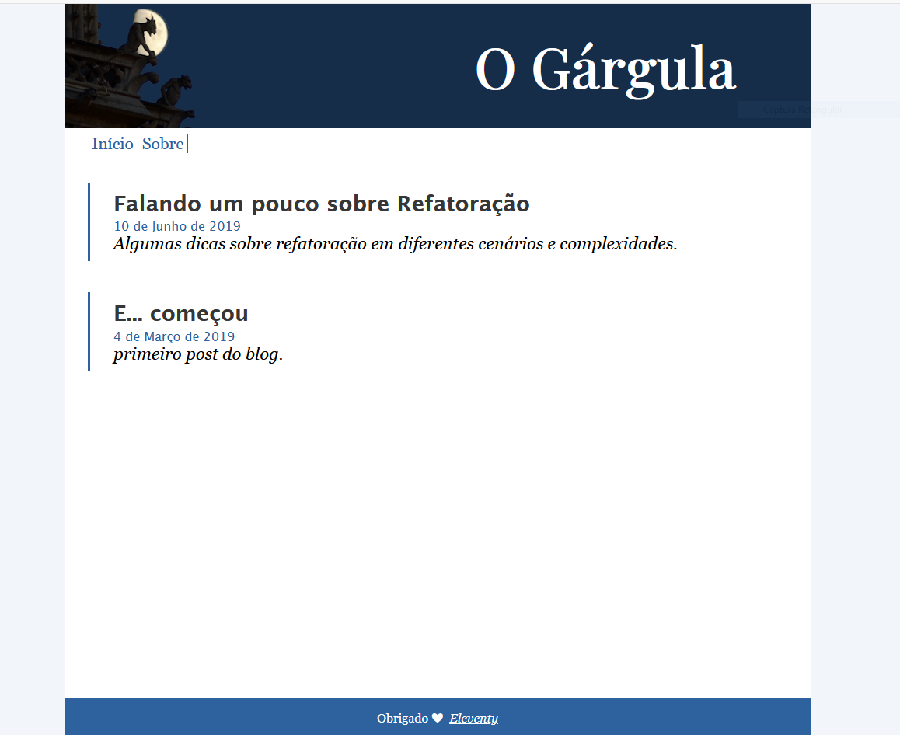
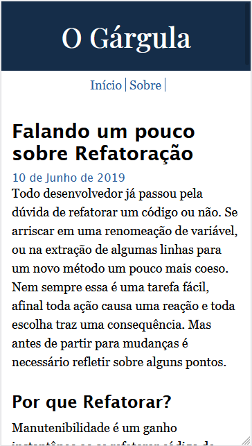

Este é um projeto onde posso testar tecnologias e compartilhar conhecimento a medida que aprendo novas coisas. Além disso é um canto onde posso escrever alguns pensamentos e opiniões sobre diversos assuntos, ligados a tecnologia ou a outros assuntos que tambem me interessam.

## Stack

Para gerar e organizar as páginas utilizo o [11ty(Eleventy)](https://www.11ty.dev/), que é um gerador de páginas estáticas que usa javascript. Muito simples e flexível.

Até o momento não uso nenhum framework como React ou Vue devido o escopo simples que esse blog possui até então. Uso apenas o [Nunjuks](https://mozilla.github.io/nunjucks/) como _template engine_

O layout foi feito apenas com CSS puro e é adaptável a vários tamanhos de tela.

 

## Hospedagem

Uso para hospedagem o [Zeit](https://zeit.co/), uma plataforma poderosa e super simples de usar, que permite que projetos sejam hospedados de maneira gratuita. Além disso mantém projetos inportantes como o [Next JS](https://github.com/zeit/next.js/)

> Visitem!!! >>> [gargula.space](https:gargula.space)
